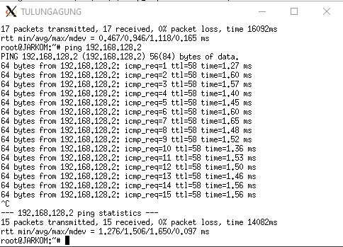

# Jarkom_Modul4_Lapres_B04

- Syubban Fakhriya  05111840000042
- Feraldy Nathanael 05111840000066

## CPT (VLSM)

**Pembagian Netmask**

**Netmask tree**

Untuk setiap subnet kita hitung kebutuhan ipnya yaitu host + 1, apabila tanpa host berarti 2 dan kita berikan pengecualian untuk server (ipnya sudah ditentukan).

|Subnet     |Jumlah IP  |Netmask    |
|-----------|-----------|-----------|
| A1        | 13        | /28       |
| A2        | 521       | /22       |
| A3        | 721       | /22       |
| A4        | 251       | /24       |
| A5        | 2022      | /21       |
| A6        | 701       | /22       |
| A7        | 501       | /23       |
| A8        | 101       | /25       |
| A9        | 1001      | /22       |
| A10       | 2         | /30       |
| A11       | 2         | /30       |
| A12       | 2         | /30       |
| A13       | 2         | /30       |
| Total     | 5840      | /19       |

Setelah menentukan kebutuhan ip kita buat pohon netmasknya seperti berikut. Pembuatannya, kita buat base ip 192.168.0.0 dengan netmask /19, kemudian kita buat child node dibawahnya dengan netmask /20 dan ip masing-masing 192.168.0.0 dan 192.168.16.0 yaitu batas terendah dan tertinggi sesuai wildcardnya, begitu seterusnya sesuai dengan kebutuhan tabel.

Kemudian kita buat desain jaringan dan pembagian ip pada cisco packet tracer seperti berikut :

Untuk setiap router yang memiliki kabel keluar kita set ipnya sesuai netmask dimana kabel dan router itu berada begitu pula dengan clientnya. Contoh perhitungan untuk router batu seperti berikut :

Disini batu memiliki 4 port yaitu Fa1/1, Fa0/0, Fa1/0, dan Fa0/1 kita berikan ip keluar yang sesuai dengan netmasknya, contoh di Fa0/0 berada pada netmask A11 maka kita set ip diantara 192.168.0.4 sampai 192.168.0.255 (bebas) dengan netmask /30. Contoh lagi untuk port Fa1/1 kita set ip sesuai netmask A7 yaitu antara 192.168.2.0 sampai 192.168.2.255 dengan netmask /23

**Routing**
Untuk routing kita ambil salah satu contoh yaitu client SIDOARJO kita sambungkan ke router surabaya dengan gambar berikut :

Disini tujuan routingnya supaya SIDOARJO bisa melakukan ping ke SURABAYA, maka konsep routingnya seperti berikut

SURABAYA
Network     : nid SIDOARJO (subnet tujuan)
Mask        : netmask subnet SIDOARJO
Next Hop    : nid PASURUAN (port menuju SURABAYA)

PASURUAN
Network     : 0.0.0.0
Mask        : 0.0.0.0
Next Hop    : nid SURABAYA (port menuju PASURUAN)

Langkah tersebut diulangi untuk semua client dan server yang belum tersambung dengan surabaya

**Testing**

Selanjunya kita coba ping cloud atau surabaya dari SIDOARJO

**Kesulitan**
Pada awalnya cukup awam dengan pembagian netmask pada tree (sampai sekarang kurang tahu kenapa memakai tree), kemudian set ip statis pada router dan client membutuhkan waktu yang sangat lama. Selain itu kami tidak terlalu mengerti harus di tes ke mana saja (seperti SIDOARJO ke MALANG dan seterusnya) sehingga kami membuat acuan ke SURABAYA saja.

## UML (CIDR)

**Pembagian Netmask**

**Netmask tree**

**Routing**

1. SURABAYA
-------------------------------------------------------------------------
route add -net 192.168.128.0 netmask 255.255.192.0 gw 192.168.192.2
route add -net 192.168.0.0 netmask 255.255.224.0 gw 192.168.32.2
route add -net 10.151.83.44 netmask 255.255.255.252 gw 192.168.32.2

2. BATU
-------------------------------------------------------------------------
route add -net 10.151.83.44 netmask 255.255.255.252 gw 192.168.8.2
route add -net 192.168.0.0 netmask 255.255.248.0 gw 192.168.8.2
route add -net 192.168.18.0 netmask 255.255.255.240 gw 192.168.16.2

3. KEDIRI
-------------------------------------------------------------------------
route add -net 192.168.0.0 netmask 255.255.252.0 gw 192.168.4.2

4. PASURUAN
-------------------------------------------------------------------------
route add -net 192.168.128.0 netmask 255.255.240.0 gw 192.168.144.2

**Testing**

- Tulungagung - Jember

- Malang - Banyuwangi

- Banyuwangi - Surabaya

- Lumajang - Jombang

